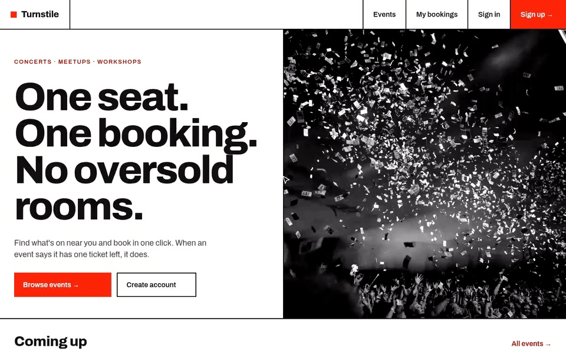

# Turnstile — Event Booking

A full-stack event booking website: a **Spring Boot** REST API and a **React** frontend.
Admins (organizers) create and manage events; users sign up, book tickets and cancel them.

The interesting part: **tickets can't be oversold**, even when many people try to book the last seat at the same moment. A test proves it.



*Public site at `localhost:5173`, organizer console at `admin.localhost:5173`. [Watch the MP4](docs/demo.mp4) for full quality.*

## Features

- **JWT authentication** — register, log in, send `Authorization: Bearer <token>`
- **Roles** — `ADMIN` manages events, `USER` books tickets. An admin account is seeded on startup.
- **Events** — public listing with filters (location, date range), paging and sorting
- **Bookings** — book, list your bookings, cancel (owner or admin only)
- **No overselling** — optimistic locking on the event's ticket counter
- **Consistent errors** — one JSON error shape with the right HTTP status (400 / 401 / 403 / 404 / 409)
- **Two sites, one app** — public website on `localhost`, organizer console on `admin.localhost`; the public bundle never loads admin code
- **Organizer console** — dashboard (upcoming events, tickets sold, revenue), event editor, all bookings

## Tech stack

**Backend:** Java 25 · Spring Boot 4.1 · Spring Security · Spring Data JPA (Hibernate 7) · PostgreSQL · jjwt · Lombok · JUnit 5 + H2 for tests

**Frontend:** React 19 · React Router · Vite · plain CSS (no UI library)

## How overselling is prevented

Each event keeps a `bookedTickets` counter and a `@Version` column.

1. Two users load the same event — both see `version = 5` and 1 ticket left.
2. Both add 1 to `bookedTickets` and try to save.
3. The database update is `... WHERE id = ? AND version = 5`. The first save wins and bumps the version to 6.
4. The second save matches 0 rows, so Hibernate throws an optimistic-lock exception. The API returns **409 Conflict** ("Someone else just booked this. Please try again.").

No database row locks are held while users wait, and a double-clicked "Book" button can't create two bookings either.

`BookingConcurrencyTest` fires 10 users at an event with 1 ticket at the same moment and checks that exactly one booking succeeds.

## API

**Public website**

| Method | Endpoint | Access | Description |
|---|---|---|---|
| POST | `/api/auth/register` | Public | Create a USER account |
| POST | `/api/auth/login` | Public | Get a JWT token |
| GET | `/api/users/me` | Signed in | Current user (name, email, role) |
| GET | `/api/events` | Public | List events (`location`, `from`, `to`, `page`, `size`, `sort`) |
| GET | `/api/events/{id}` | Public | Get one event |
| POST | `/api/bookings` | User | Book a ticket — body: `{ "eventId": "..." }` |
| GET | `/api/bookings` | User | My bookings, newest first |
| GET | `/api/bookings/{id}` | Owner | Get one booking |
| PATCH | `/api/bookings/{id}/cancel` | Owner | Cancel a booking |
| GET | `/actuator/health` | Public | Health check |

**Organizer console** — everything under `/api/admin` requires the `ADMIN` role

| Method | Endpoint | Description |
|---|---|---|
| GET | `/api/admin/stats` | Dashboard numbers |
| POST | `/api/admin/events` | Create an event |
| PUT | `/api/admin/events/{id}` | Update an event |
| DELETE | `/api/admin/events/{id}` | Delete an event (only if it has no bookings) |
| GET | `/api/admin/bookings` | All bookings, newest first |
| PATCH | `/api/admin/bookings/{id}/cancel` | Cancel anyone's booking |

**Error format**

```json
{
  "status": 400,
  "message": "Validation failed",
  "errors": { "email": "must be a well-formed email address" },
  "timestamp": "2026-10-04T18:00:00"
}
```

## Run it locally

**You need:** Java 25 and a running PostgreSQL database.

1. Create a database, e.g. `event_booking`.
2. Create `event-booking-backend/local.env.sh` (it's git-ignored):

   ```bash
   export DB_URL=jdbc:postgresql://localhost:5432/event_booking
   export DB_USERNAME=postgres
   export DB_PASSWORD=your-db-password
   export JWT_SECRET=a-random-string-at-least-32-characters-long
   export ADMIN_EMAIL=admin@example.com
   export ADMIN_PASSWORD=choose-a-strong-password
   ```

3. Start the app:

   ```bash
   cd event-booking-backend
   source local.env.sh
   ./gradlew bootRun
   ```

Tables are created automatically on first start, and the admin account from `ADMIN_EMAIL` / `ADMIN_PASSWORD` is created if it doesn't exist. The API runs on `http://localhost:8080`.

Want some events to look at? With the app running:

```bash
./scripts/seed-sample-events.sh   # adds 8 upcoming sample events via the admin API
```

### Try it

```bash
# Log in as admin
curl -X POST localhost:8080/api/auth/login -H 'Content-Type: application/json' \
  -d '{"email":"admin@example.com","password":"choose-a-strong-password"}'

# Create an event (use the token from above)
curl -X POST localhost:8080/api/admin/events -H "Authorization: Bearer <TOKEN>" \
  -H 'Content-Type: application/json' \
  -d '{"title":"Tech Meetup","category":"MEETUP","location":"Pune","eventDate":"2026-12-01T18:00:00","totalTickets":50,"price":199.00}'

# Browse events (no token needed)
curl "localhost:8080/api/events?location=pune"
```

## Run the website

With the backend running on port 8080:

```bash
cd event-booking-frontend
npm install
npm run dev
```

| Site | URL | What's there |
|---|---|---|
| Public website | `http://localhost:5173` | Browse events, sign up, book and cancel |
| Organizer console | `http://admin.localhost:5173` | Sign in with `ADMIN_EMAIL` / `ADMIN_PASSWORD` |

Browsers send `*.localhost` to your own machine, so the admin address works with no extra setup. Each site keeps its own login. Vite forwards `/api` calls to `localhost:8080`, so no CORS setup is needed in development.

## Tests

```bash
cd event-booking-backend
./gradlew test
```

Tests use an in-memory H2 database, so PostgreSQL isn't needed.

## Project structure

```
event-booking-frontend/src/
├── main.jsx      picks the site from the hostname and lazy-loads only that one
├── site/         public website: Header, Landing, Events, EventDetail, MyBookings
├── admin/        organizer console: sidebar layout, Dashboard, Events, Event form, Bookings
├── ui/           shared: sign-in page, toasts + confirm dialog, error banner, route guards
├── api/          fetch wrapper (JWT, error shape) + one function per endpoint
├── auth/         AuthContext: token, current user, login / register / logout
└── lib/          formatting helpers, site URLs (public vs admin)

event-booking-backend/src/main/java/com/example/eventbooking/
├── config/       SecurityConfig, AdminSeeder
├── controller/   Auth, User, Event, Booking, Admin REST controllers
├── service/      Business logic (booking rules, ownership checks)
├── repository/   Spring Data JPA repositories
├── model/        User, Event, Booking entities
├── dto/          Request / response records
├── security/     JWT service and filter
└── exception/    Custom exceptions + global error handler
```
